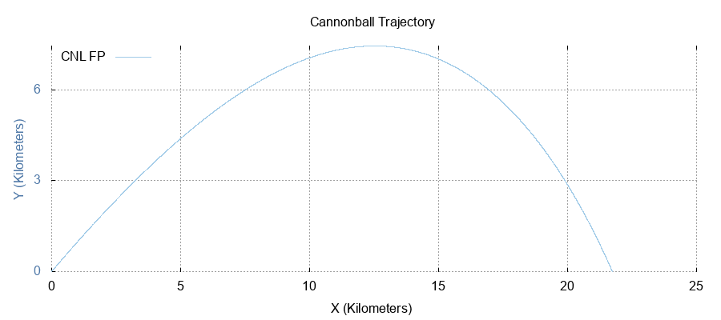

Toy Physics Simulation
======================

TODO:
-----
   1) Choose a suitably complex problem (currently solving the trajectory of a cannon shell). 
   2) Implement Fixed Point Arithmetic Library defined here http://www.open-std.org/jtc1/sc22/wg21/docs/papers/2019/p0037r6.html and implemented here https://github.com/johnmcfarlane/cnl
   3) Study Performance benefits vs floating point, scaling, etc

**The cannonball equation**:

.. math::
   \ddot{x} = \frac{F_{drag,x}}{m}, \ddot{y} = -g + \frac{F_{drag,y}}{m}

Has a final solution that looks like this, by the way:

