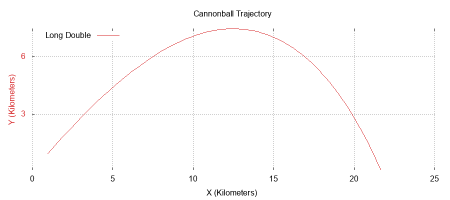

Trajectory of A Cannonball
==========================

Goals:
------
   1) Implement Fixed Point Arithmetic Library defined here http://www.open-std.org/jtc1/sc22/wg21/docs/papers/2019/p0037r6.html and implemented here https://github.com/johnmcfarlane/cnl in a toy simulation of a cannonball being fired out of a cannon.
   2) Study Performance benefits vs floating point, scaling, etc

**The cannonball equation**:

.. math::
   \ddot{x} = \frac{F_{drag,x}}{m}, \ddot{y} = -g + \frac{F_{drag,y}}{m}

Has a final solution that looks like this, by the way:

CNL Precision:
--------------
    A fixed point variable is fundamentally an integer with some associated scaling factor. This allows you to choose a width via choosing the integer type (int32, int16, int8, etc) and the number of bits to the left and right of the decimal. For example, if you have an int16 as your base integer type, you could choose to have 9 bits to the left of the decimal and 7 bits to the right of the decimal, yielding a range of (abs(2^-7), abs(2^9)). 
    This cannonball simulation is relatively simple, but requires careful consideration of decimal placement. Too much precision and you will get overflow during multiplies. Too little precision and you will get underflow on adds and subtracts. The strategy thus is to calculate the upper limit for each variable present in the simulation, and then give it that many digits to the left of the decimal. Thus maximizing the precision you have to work with, in turn maximizing the accuracy of the simulation.
    Here are our calculations for the limits of each of our units in the simulation:
      Mass: [1,262144] (elastic integer with width of 2^18)
      The limits for mass were chosen because the expected mass value is 100,000 grams. This looks like `mass = cnl::fixed_point<cnl::elastic_integer<19>, 0>`
      Velocity: [.000002, 8192] (elastic integer)
      The limits for velocity were chosen because the expected velocity in the x and y directions are approx 500m/s, and so when calculating the trajectory this means we have to handle a number on the order of 10^4.
      Position: [.00003, 65536] meters (elastic integer)
      The limits for position were chosen because the maximum trajectory our cannonball can reache is around 60k under optimum initial conditions (infinite weight)
      Time delta: [.00000000745,4096]
      The limits for the time delta were chosen to allow for a time delta as small as 10^-5 but still allowing the velocity delta to have thirty two bits of precision instead of thirty one.
